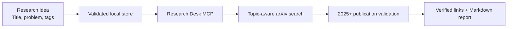

# Research Desk MCP

**A local-first research workflow that turns structured ideas into focused, recent literature discovery.**

Research Desk is a Model Context Protocol (MCP) server that connects the earliest stage of research—capturing an idea—with one of the most repetitive stages that follows: finding relevant academic work. It gives AI assistants a reliable way to understand saved research topics, act on them by ID, and retrieve recent papers from arXiv without losing the original research context.

## Project Story

Research ideas often begin as short notes scattered across documents, conversations, and bookmarks. As the collection grows, the difficult part is no longer generating ideas; it is preserving their context and repeatedly translating each one into useful literature searches.

Research Desk began with a simple question:

> What if a research idea could become a durable object that an AI assistant can understand, organize, evaluate, and investigate?

The project answers that question with a lightweight MCP layer. Each idea is stored with a title, problem statement, tags, priority, status, and stable numeric ID. An AI client can then use that ID to manage the idea or discover related literature. This creates a consistent path from curiosity to evidence while keeping the researcher's data local and transparent.

## The Problem

Traditional literature discovery creates several points of friction:

- Research context must be rewritten for every new search.
- Generic keywords often produce broad or outdated results.
- Ideas and discovered literature live in separate systems.
- It is difficult to track which topics are new, active, paused, or published.
- AI assistants need a structured interface before they can act reliably on a research collection.

## The Solution

Research Desk combines validated local storage, MCP-native tools, and the public arXiv API into one focused workflow.



The saved idea remains the source of truth. Its title and tags are converted into a focused arXiv query, while the server applies both remote and local publication-date checks. Every successful search automatically produces a uniquely named Markdown report in the user's Downloads folder. The MCP response also contains structured paper metadata and canonical arXiv links.

## Core Capabilities

| Capability | Description |
| --- | --- |
| Structured idea capture | Stores titles, problem statements, tags, priorities, timestamps, and workflow status. |
| ID-driven discovery | Uses a stable idea ID to search the literature and automatically export the results. |
| Recent-paper filtering | Enforces an original arXiv publication year of 2025 or later. |
| Trusted links | Returns canonical HTTPS abstract and PDF links hosted on `arxiv.org`. |
| Downloadable reports | Creates timestamped Markdown literature reports in the user's Downloads folder. |
| Workflow tracking | Supports ideas from initial capture through exploration, experimentation, publication, or pause. |
| Portfolio overview | Summarizes idea counts, common tags, status distribution, and high-priority topics. |
| AI-native integration | Exposes tools, a readable resource, and an evaluation prompt through FastMCP. |

## Engineering Design

The project is intentionally small, inspectable, and dependency-light.

- **Validated local storage:** Every read and write checks the research-idea schema before the data is used.
- **Atomic persistence:** Updates are written to a temporary file and safely replaced, reducing the risk of a partially written JSON store.
- **Deterministic retrieval:** Numeric IDs avoid ambiguity when several topics use similar language.
- **Defensive date enforcement:** The query begins at 2025, and every result is checked again using its original publication timestamp.
- **Safe link construction:** Feed links are validated and converted into canonical arXiv HTTPS URLs.
- **Polite API access:** Uncached arXiv requests are spaced by at least three seconds, and identical searches use an in-memory daily cache.
- **Non-destructive exports:** Every report receives a unique timestamped filename so an existing report is never overwritten.
- **Resilient integration:** Invalid IDs, malformed XML, network failures, timeouts, and upstream HTTP errors return structured responses instead of crashing the server.
- **Minimal dependency surface:** HTTP requests and Atom parsing use Python's standard library; FastMCP is the only application dependency.

## MCP Surface

Research Desk provides five focused tools:

- Add a structured research idea.
- Search existing ideas by keyword.
- Find 2025+ arXiv papers for an idea ID and automatically export a Markdown report.
- Update an idea's research status.
- Generate a compact research portfolio dashboard.

It also exposes the complete idea collection as a readable MCP resource and includes a structured prompt for evaluating significance, novelty, feasibility, methodology, risks, and expected contribution.

## Technology

- Python 3.10+
- Model Context Protocol with FastMCP
- arXiv public API
- Atom XML
- Local JSON persistence
- Python `unittest`

## Project Structure

```text
research_desk_mcp/
├── data/
│   └── research_ideas.json
├── research_desk/
│   ├── __init__.py
│   ├── arxiv.py
│   ├── config.py
│   ├── reports.py
│   └── storage.py
├── tests/
│   └── test_server.py
├── .vscode/
│   └── mcp.json
├── server.py
├── requirements.txt
├── .gitignore
└── README.md
```

`server.py` is now a focused MCP interface. Storage, arXiv communication, report generation, and shared configuration are separated into small modules so each responsibility can be understood and tested independently.

## Quality and Verification

The automated suite covers the project's highest-risk boundaries:

- Idea creation, keyword search, status updates, and dashboard summaries.
- Schema validation and atomic JSON persistence.
- Query construction with the fixed 2025 start date.
- Rejection of older publications and non-arXiv hosts.
- Canonical abstract and PDF link generation.
- Daily in-memory caching for repeated searches.
- Automatic Markdown creation, report content, and non-destructive filenames.
- Validation of unknown idea IDs and unsafe result limits.

## Project Impact

This project demonstrates more than API integration. It shows how to design an AI-facing tool around a real workflow, define trust boundaries, preserve local ownership of data, and make external information predictable enough for an agent to use. The same architecture can be extended to thesis planning, systematic reviews, R&D portfolio management, or other scholarly sources with explicit provenance controls.

## Future Direction

- Relevance scoring tailored to each research problem.
- Search-history and paper-bookmark persistence.
- Duplicate-paper detection across related ideas.
- Citation export for reference managers.
- Multi-source discovery with explicit provenance controls.
- A lightweight interface for browsing ideas and saved papers.

## Acknowledgment

Thank you to arXiv for use of its open-access interoperability.

## Author

**Badar Rasheed Butt**  
_Researcher_

Created and developed with a focus on practical, AI-assisted workflows for modern research discovery.
