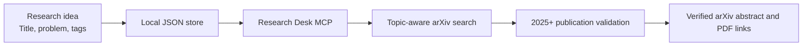

# Research Desk MCP

**A local-first research workflow that turns structured ideas into focused, recent literature discovery.**

Research Desk is a Model Context Protocol (MCP) server built to connect the earliest stage of research—capturing an idea—with one of the most repetitive stages that follows: finding relevant academic work. It gives AI assistants a reliable way to understand saved research topics, act on them by ID, and retrieve recent papers from arXiv without losing the original research context.

## Project Story

Research ideas often begin as short notes scattered across documents, chats, and bookmarks. As the collection grows, the difficult part is no longer generating ideas; it is preserving their context and repeatedly translating each one into useful literature searches.

Research Desk started from a simple question:

> What if a research idea could become a durable object that an AI assistant can understand, organize, evaluate, and investigate?

The project answers that question with a lightweight MCP layer. Each idea is stored with a title, problem statement, tags, priority, status, and stable numeric ID. An AI client can then use that ID to manage the idea or discover related literature. This creates a consistent path from curiosity to evidence while keeping the researcher's data local and transparent.

## The Problem

Traditional literature discovery creates several points of friction:

- Research context must be rewritten for every new search.
- Generic keywords often produce broad or outdated results.
- Ideas and discovered literature live in separate systems.
- It is difficult to track which topics are new, active, paused, or published.
- AI assistants need a structured interface before they can act reliably on a research collection.

## The Solution

Research Desk combines structured local storage, MCP-native tools, and the public arXiv API into one focused workflow.



The idea remains the source of truth. Its title and tags are converted into a focused arXiv query, while the server applies both remote and local publication-date checks. Every successful search automatically produces a timestamped Markdown report in the user's Downloads folder, while the MCP response also contains structured paper metadata and canonical arXiv links.

## Core Capabilities

| Capability                 | Description                                                                                            |
| -------------------------- | ------------------------------------------------------------------------------------------------------ |
| Structured idea capture    | Stores research titles, problem statements, tags, priorities, timestamps, and workflow status.         |
| ID-driven discovery        | Uses a stable idea ID to search the literature and automatically export the result as Markdown.         |
| Recent-paper filtering     | Enforces an original arXiv publication year of 2025 or later.                                          |
| Source-controlled links    | Returns only canonical HTTPS abstract and PDF links hosted on `arxiv.org`.                             |
| Downloadable reports       | Creates timestamped Markdown literature reports directly in the user's Downloads folder.              |
| Research workflow tracking | Supports idea states from initial capture through exploration, experimentation, publication, or pause. |
| Portfolio-level overview   | Summarizes idea counts, common tags, status distribution, and high-priority topics.                    |
| AI-native integration      | Exposes tools, a readable resource, and a reusable evaluation prompt through FastMCP.                  |

## Engineering Design

The project is intentionally small, inspectable, and dependency-light.

- **Local-first storage:** Research ideas remain in a human-readable JSON file with no database requirement.
- **Deterministic retrieval:** Numeric IDs avoid ambiguity when multiple topics use similar language.
- **Defensive date enforcement:** The arXiv query starts at 2025, and every returned paper is validated again using its original publication timestamp.
- **Safe link construction:** External links from the feed are not passed through blindly; accepted arXiv identifiers are converted into canonical HTTPS URLs.
- **Non-destructive report output:** Every Markdown export receives a unique timestamped filename, preventing an existing report from being overwritten.
- **Bounded requests:** Search result limits protect both the local workflow and the public API from unnecessarily large requests.
- **Resilient integration:** Invalid IDs, malformed XML, network failures, timeouts, and upstream HTTP errors return structured responses instead of crashing the server.
- **Minimal external surface:** HTTP requests and Atom parsing use Python's standard library; FastMCP is the only application dependency.

## MCP Surface

Research Desk provides six focused tools:

- Add a structured research idea.
- Search existing ideas by keyword.
- Find recent arXiv papers for a selected idea ID and automatically export the results to Markdown.
- Create a structured Markdown literature report in the local Downloads folder.
- Update an idea's research status.
- Generate a compact research portfolio dashboard.

It also exposes the complete idea collection as an MCP resource and includes a structured prompt for evaluating research significance, novelty, feasibility, methodology, risks, and expected contribution.

## Technology

- Python 3.10+
- Model Context Protocol with FastMCP
- arXiv public API
- Atom XML
- Local JSON persistence
- Python `unittest`

## Project Structure

```text
research_desk_mcp/
├── data/
│   └── research_ideas.json
├── tests/
│   └── test_server.py
├── .vscode/
│   └── mcp.json
├── server.py
├── requirements.txt
├── .gitignore
└── README.md
```

## Quality and Verification

The automated test suite covers the highest-risk boundaries of the integration:

- Research query construction and the fixed 2025 start date.
- Independent rejection of papers published before 2025.
- Rejection of non-arXiv hosts from returned results.
- Canonical abstract and PDF link generation.
- Markdown report content, unique filename generation, and output-directory handling.
- Validation of unknown idea IDs and unsafe result limits.

The arXiv connection and full response-parsing path have also been validated against live public results.

## Portfolio Value

This project demonstrates more than API integration. It shows how to design an AI-facing tool around a real workflow, define clear trust boundaries, preserve local ownership of data, and make external information predictable enough for an agent to use. The same architecture can be extended to other scholarly sources or adapted for research teams, thesis planning, systematic reviews, and R&D portfolio management.

## Future Direction

- Relevance scoring tailored to each research problem.
- Search-history and paper-bookmark persistence.
- Duplicate-paper detection across related ideas.
- Citation export for reference managers.
- Daily caching that respects arXiv usage guidance.
- Multi-source discovery with explicit provenance controls.
- A lightweight dashboard for browsing ideas and saved papers.

## Acknowledgment

Thank you to arXiv for use of its open-access interoperability.

## Author

**Badar Rasheed Butt**  
_Researcher_

Created and developed with a focus on building practical, AI-assisted workflows for modern research discovery.
